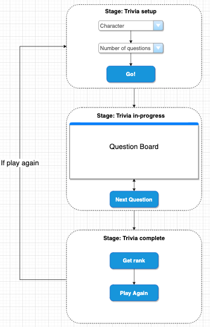
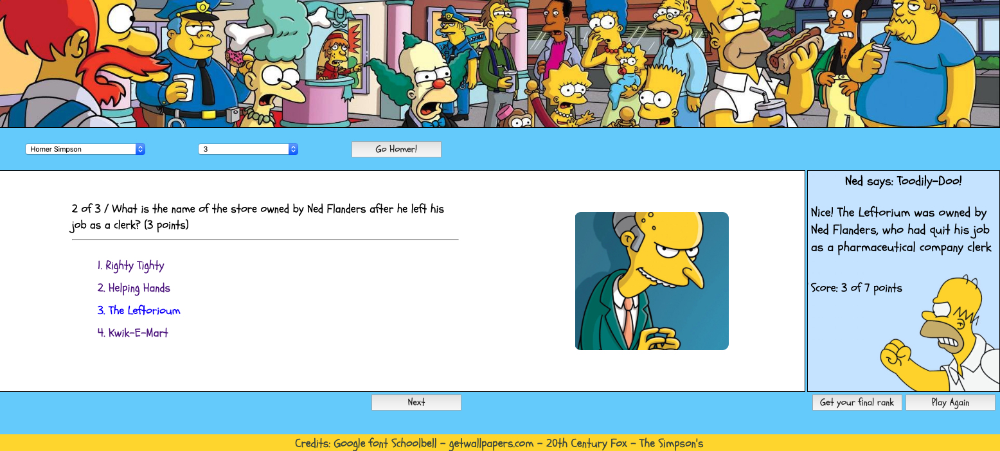

# _The Simpson's_ Trivia Game
Developer: Cesar Trevino  
Main goal: Put into practice the knowledge of HTML, CSS and JavaScript learned in our SEI program

### The game
- - -
The _Simpson's_ Trivia game is the first project of SEI program with General Assembly  
As a regular trivia the purpose is
 * To answer a number of questions to define much you know about certain topic.
 * The dificulty level of a question ranges from easy to dificcult having a score associated with this complexity.
 * Your knowledge level is determined by the accumulated score
#### Why _The Simpons_?
  This cartoon has been transmitted in Mexico since 1989. Many fans are dispersed all over the country and even when this cartoon originally was created to represent the life of regular american family many of us have been captured by the characters finding similarities with our mexican families.

## Definition of the product
- - - 

## Product design (wire-framing)
- - -

## Technology:
- - -
* Code versioning and control tools
  * Git: Local tool running on my computer to keep control of application changes
  * Git hub: Online integrated tool, [GitHub](https://www.github.com) keeps the application repository 
* Developer tools  
  * Command line: It enables the computer interaction
  * Visual Studio Code: For coding HTML, css and javascript
  * Google Chrome Developer tools: For troubleshooting and debugging
  * Google Chrome Browser: For displaying the application
* Wireframing
  * Designing of the trivia UI. [(diagrams.net)](https://app.diagrams.net)
* Image tools & sources
  * Source of wallpapers and images: [Include images in the UI](http://getwallpapers.com)
  * Image editor: MacBook _Preview_ tool for editing images
  * Color picker: Image color picker to edit the background of some images. [(imagecolorpicker.com)](https://imagecolorpicker.com/)

## Solution
- - -
### Flow chart

### Approach
* Four arrays
  * Array that contains all the question info (position 0 are the instructions of the game)
  * Array that contains all the values for character selection (colors and images)
  * Array that contains the five different leves of knowledge than the application can display
  * Array that contains the images being displayed every 5 seconds
* Three objects
  * One object that manage the question (question, answers, correct answer, points, messages if it is correct, messages it is incorrect, etc.)
  * One object that manage the trivia (Scores, if it is in progress or complete, evaluate the level of knowledge, etc.)
  * One object that manage the dashboard (Display messages mainly sent by question or trivia)
* Event listeners
  * Go button - Starts the game once setup is complete (number of questions and character)
  * Next button - Move to the next question
  * Rank button - Evaluate your level of knowledge based on the scores
  * Play again button - Reset the game
  * Answer options - Which option the user is selection
* Time interval
  * To display images randomly every 5 seconds

### Control flow
* The diagram depicts how the controls are related depending on the stage of the trivia  
* The elements where positioned based on this dependency  

## User requirements
- - -
* Web browser
* Internet connectivity

## User interface
- - -

